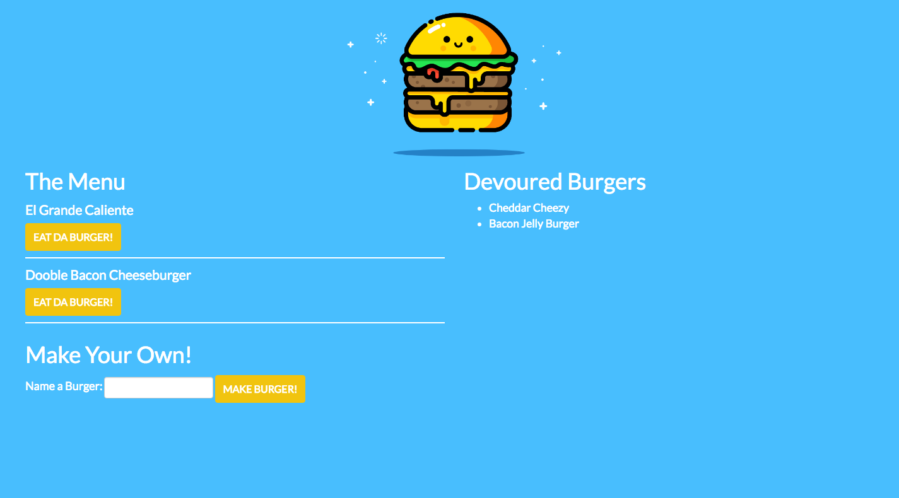

# Burger Logger
A burger logger with MySQL, Node, Express, Handlebars and a homemade ORM

## Installation
npm install package.json to get node modules

## Live Demo
[Demo](http://infinite-bayou-22864.herokuapp.com/burgers)

## Usage
Eat burgers
Add burgers
Track devoured burgers

## Contributing
1. Fork it!
2. Create your feature branch: `git checkout -b my-new-feature`
3. Commit your changes: `git commit -am 'Add some feature'`
4. Push to the branch: `git push origin my-new-feature`
5. Submit a pull request 
